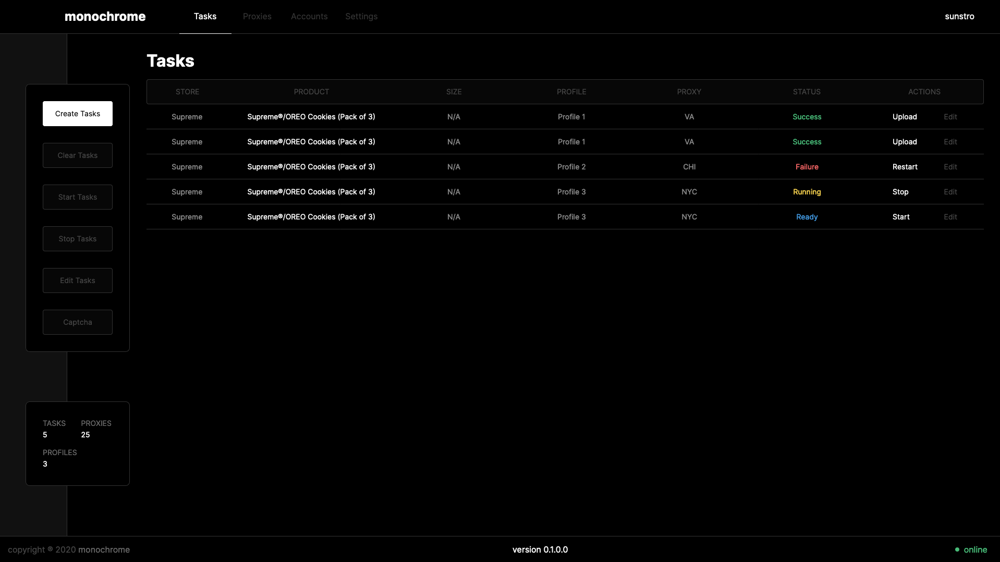

# monochrome

> you are traveling through another dimension.. - R.S

## What is it

Open sourced front-end for automation programs.

## Development

Built with [react](https://reactjs.org/). You'll need [node.js](http://nodejs.org/) & [yarn](https://yarnpkg.com/).

```bash
# clone repo
git clone https://github.com/SunstroUS/monochrome.git

# install dependencies
yarn install

# start app on port 3000
yarn start
```

## Current look



## License

<a href="/LICENSE.md">MIT</a>
